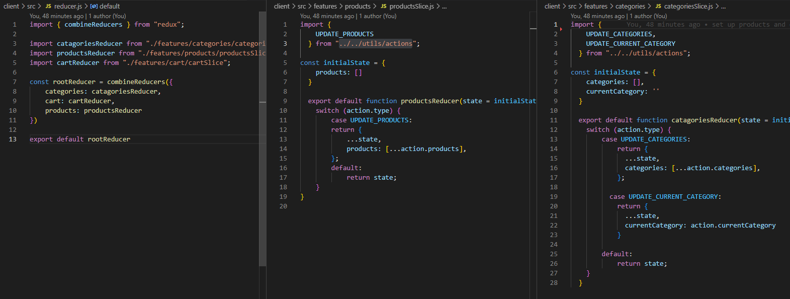
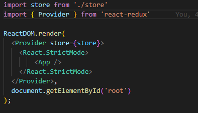

# Redux-Refactor

## Table of Contents

- [Description](#description)
- [Contributors](#contributors)
- [Features](#features)
- [Installation](#installation)
- [Usage](#usage)
- [Contact Information](#contact)
- [License](#license)

## Deployed Application

https://guarded-caverns-64367.herokuapp.com/

## Description

This was an extra credit project where I took an existing Context based React application and refactored it to use Redux. As such there really isn't much to say about this unless you want to see how it uses redux stores reducers and actions to update the global store and pull information from it.

 I had to wrap the application in a redux provider in order to be able to use the useSelector hook so that the application could read the updated redux store.

I hope this application helps out those who are looking to implement redux to better utilize global store in their applications. Thank you very much for looking at this.

## Contributors

David Samuelson

## Features

- uses Redux

- uses Redux best practices for labeling and file organization

- offline functionality

- context base refactored for Redux

## Installation

- clone code to local repository

- run npm install on the base folder outside of the client and src directories

## Usage

- All values are hardcoded so really it's just a matter of looking at the coding to see if you can determine how it's working to adjust to your needs

## Contact

linksn.1fan@gmail.com

GitHub: https://github.com/dsamuelson?tab=repositories

## License

Link: https://choosealicense.com/licenses/unlicense/

License Terms:
This is free and unencumbered software released into the public domain.

Anyone is free to copy, modify, publish, use, compile, sell, or
distribute this software, either in source code form or as a compiled
binary, for any purpose, commercial or non-commercial, and by any
means.

In jurisdictions that recognize copyright laws, the author or authors
of this software dedicate any and all copyright interest in the
software to the public domain. We make this dedication for the benefit
of the public at large and to the detriment of our heirs and
successors. We intend this dedication to be an overt act of
relinquishment in perpetuity of all present and future rights to this
software under copyright law.

THE SOFTWARE IS PROVIDED "AS IS", WITHOUT WARRANTY OF ANY KIND,
EXPRESS OR IMPLIED, INCLUDING BUT NOT LIMITED TO THE WARRANTIES OF
MERCHANTABILITY, FITNESS FOR A PARTICULAR PURPOSE AND NONINFRINGEMENT.
IN NO EVENT SHALL THE AUTHORS BE LIABLE FOR ANY CLAIM, DAMAGES OR
OTHER LIABILITY, WHETHER IN AN ACTION OF CONTRACT, TORT OR OTHERWISE,
ARISING FROM, OUT OF OR IN CONNECTION WITH THE SOFTWARE OR THE USE OR
OTHER DEALINGS IN THE SOFTWARE.

For more information, please refer to <https://unlicense.org>
    
